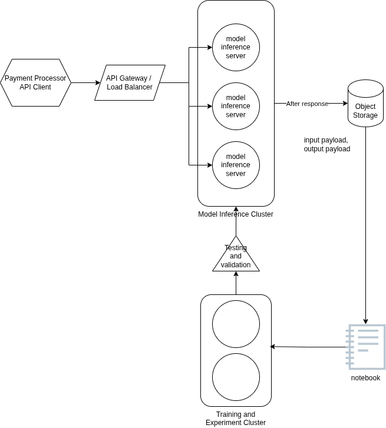

# Real-Time Payment Fraud Detector

## Prompt
Design a real-time fraud detection system for a payment processor handling 10,000 transactions per second, with sub-100ms latency requirements and the ability to adapt to new fraud patterns.

## Design

### Requirements

#### Clarifying Questions
* Do we expect to to need to support multiple types of fraud models?
* Do we need to include an experimentation and training platform for data scientists?
* Will the data be available from the client or do we need to setup a separate real-time data pipeline? 

#### Problem Framing
* Fraud is a rare event - expect < 1 % of transactions 
* Binary classification
* Threshold-dependent - we can experiment with different probability thresholds and will want to ensure probabilities are stored

#### Functional
1. Label payments as 'fraud' or 'not fraud' 
2. Experiment with new models
3. Capture ground truth (fraud ) reporting data pipeline

#### Non-functional
1. Response latency: < 100ms
2. Throughput: 10,000 transactions / second

#### High-level
Based on the throughput and streaming requirements, the two potential inference patterns are a streaming pipeline or a rest api. If the business requires the main payment workflow to stop a transaction, then the rest-api will make sense. If the the business simply wants to immediately flag potential fraud cases in a dataset then the system can operate as an inference streaming processing where the system merely sends a stream out to a downstream processor. 

We'll assume the system wants to immediately stop the payment and thus design a rest api. 

A high-level diagram might look like:

This shows the basic infrastructure - a cluster, object storage and a link to a training and experimentation environment. Finally, we'll want to be sure all kinds of testing is done. 

#### Inference Serving - Low Level Design

Inference serving is going to require solving for:
1. Containerization. Containerization has no substitute for ensuring parity between testing and live environments. 
2. Distributed serving. At 10k requests per second we can be confident that no single server  is up to the task. We need therefore to be able to handle gradual updates to an inference server, and ensure traffic is routed to the appropriate server. There are many cloud or self-hosted options that can handle traffic routing and serving for us. 
3. Server Performance monitoring. To ensure our latency SLA's are met, we need to be measuring P50, P90, P99, and alarming when SLA's are breached. We should have a dashboard to be able monitor overall performance and drill into individual nodes
4. Server performance logging. We need to be able to read execution logs and tie to individual  nodes and model versions being used
5. Model performance monitoring. Since this is a fraud use case, ground truth verification will likely not be available immediately after serving. But we can still monitor the probability distribution of raw predictions and make sure it follows the proportions we expect from our model building. We can also check for frequent outliers in the output distribution, and anomalies in features
6. Drift monitoring. Methods for fraud will change over time so we should expect our model's to relationship between features and model to drift as well (concept drift). We should also monitor the feature distribution time (feature drift). To enable drift monitoring we will need a method to log all raw input features, ideally also processed features, and our output responses (including raw probabilities). Since disk writes can take 10-15 ms or more, we should ensure this is performed async, either using a built-in async process like FastAPI's Background tasks or by setting up our own queue-based logging service where our inference server aggregates each dataset and sends them as a data payload to a queue. File size may be an issue in this case. 
7. A/B testing of different model versions. We must be able to test different model versions in order to drive performance. 
8. Security - Payments are extremely sensitive and can have regional data requirements. They will require stringent authorization setup on access and least privilege (read-only) for operational roles. 

How do we pull all of this off? For containerization, we should use a container management repository that will handle versioning and tagging. AWS Elastic Container Repository is a solid service. 

We can use Sagemaker endpoints to handle distributed serving. Sagemaker endpoints allow attaching multiple endpoints and allow metric-based autoscaling. Sagemaker will handle automatic routing and rollouts. It also allows A/B testing variants by % of traffic and tracking which variants are used. One drawback of Sagemaker variants is that it doesn't allow for persistance of experiment group . However, for our fraud case each payment should be a separate instance. 

For server performane monitoring, we can use built-in cloud tools like Cloudwatch until we run into capabilities they don't have. Later, New Relic or similar more robust solutions could be used. Likewise for logging we could utilize Cloudwatch logs. However, payments data being so sensitive, it would be advised to enable AWS Customer-Managed KMS keys. 

#### Training Orchestration- Low Level Design
Fraud models may vary from tree-based models to graph neural networks or attention-based neural networks. While tree-based models best fit our SLA requirements, we want to create an environment that enables the best models for our use case to be deployed and meet the SLA. Based on the fact we process 10k payments / second, we can assume our training data size could be 10,000 * ~100000 = 1,000,000,000 records per day. If we want to train over the past month, we quickly get to 3B records in the training set. 

#### Model Testing & CICD